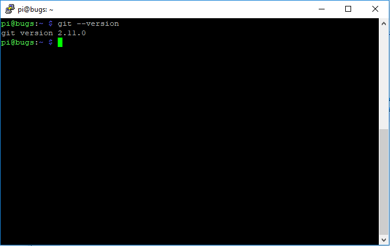
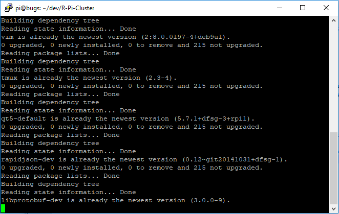
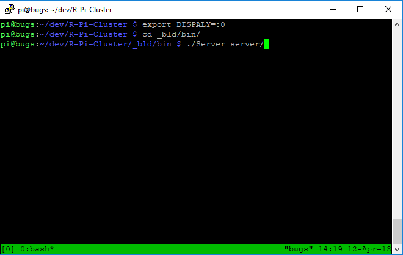

# R-Pi-Cluster
Distributed self healing super computer

To Build, you must install rapidjson, QT5, and google protobufs
Everytime you push up to github, jenkins will pull it down and test it.

Sample Programs:
https://github.com/cambamfransan/RPiCalc

Step 1:
Navigate to the directory where the cluster will run.
Verify that git is installed by running git –-version. If it is not installed, it will say git is not installed. To install git, run sudo apt-get install git
To download the cluster, run "git clone https://github.com/cambamfransan/R-Pi-Cluster"

Step 2:
After running git clone, a new folder called R-Pi-Cluster will be in the current directory. 
Run "./R-Pi-Cluster/Scripts/Install.sh"
This will install the dependencies for the server and build the program.

Step 3:
There will be a new directory called _bld. Go into that directory and start tmux by entering tmux.
It will appear as a new terminal.
Tmux was installed during the install script.
Run "export DISPLAY=:0" This will set the server to use the xserver on the raspberry pi.

Step 4:
Navigate to ./_bld/bin.
Run "./Server <database> &" where <database> is where all of the server’s database files will be stored. This should have at least 32 GBs of storage. If many jobs will be ran, additional storage may be required.
Exit out of tmux by typing "tmux detach". 

To add a client:
To start a Client, follow the above instructions on another Raspberry Pi, except instead of running "./Server <database>",
run "./Client <server IP> <server Port> <database>", where <server IP> is the ip address of the server, and <server Port>
 is the port the server is running on. <database> is where all the files will be stored on the client.

